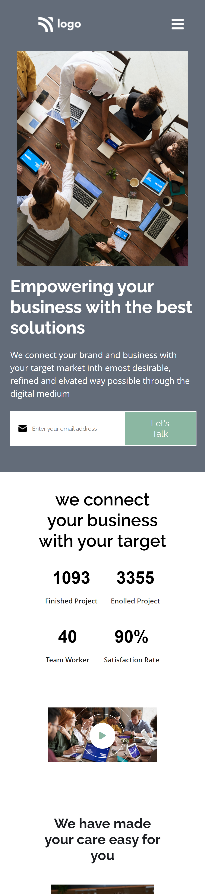

# Business landing page  

This is Business landing page made using pure html and css. It is also mobile responsive.

## Preview

1. Desktop view
   
2. mobile view
   

## Author

- [Rakshit Koyani](https://www.github.com/rakshitkoyani)
  - 
  - 
  - 

## What I have learnt in this project

1. This project helped me to understand alignment and polish the flexbox knowledge.

## Honest Time to finish the project

It takes me around 8 hours to complete me this project.

## Live link of the project

https://app.netlify.com/sites/rakshit-business-landingpage
